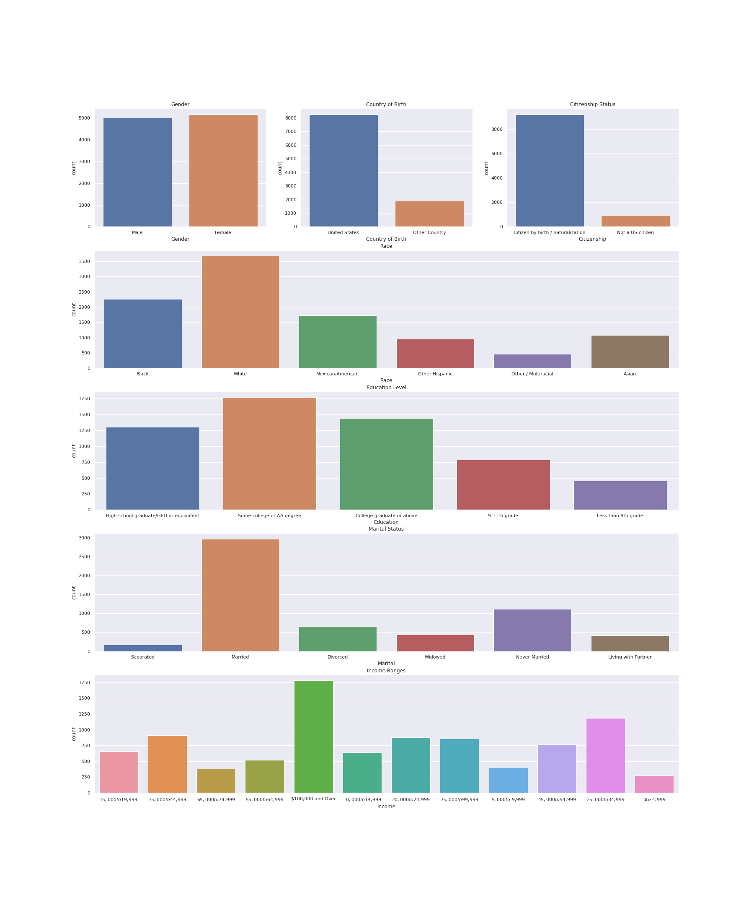
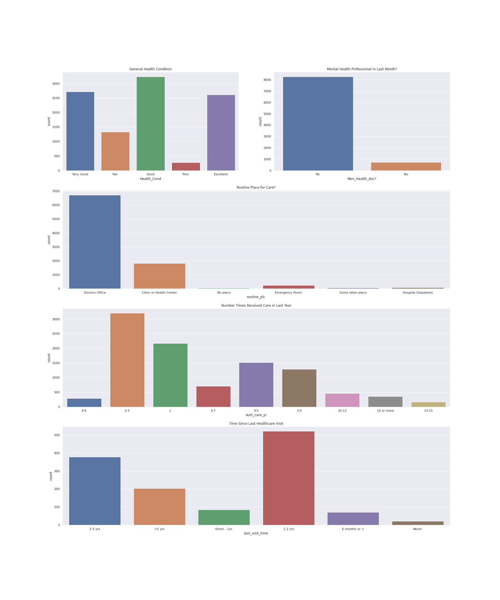
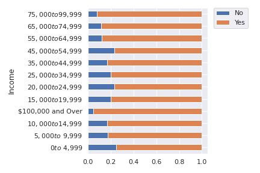
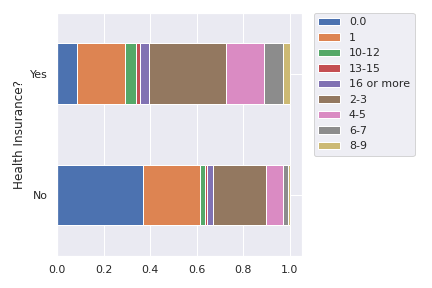
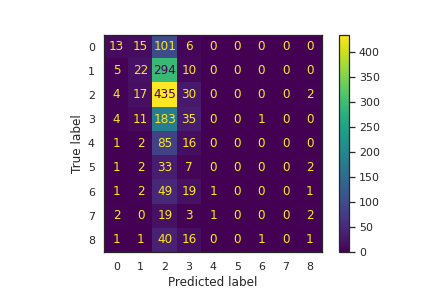

# TITLE: Socioeconomical Impacts on Healthcare Access Trends
## Team Members: Sydney Brown and Christina Hummel
## Date: 12/10/2020

# Probelm Statement and Motivation
As bioengineering students, we are passionate about the intersection of data science and healthcare. For this project, our particular interests surround the investigation of healthcare data to determine how demographic variables such as race, gender, and household income play a role in influencing access to care by looking at variables such as private insurance information, default care location/source, and primary healthcare provider. In addition, we would like to predict the number of times an individual receives care per year based on inputs such as income, health condition, routine place of care, and insurance. By exposing the distribution of healthcare access for people across the United States, potential areas of improvement may be highlighted to help work towards positive change. 

# Introduction and Description of Data

Based on the current state of the world and the struggle to combat the COVID-19 pandemic, it is clear that improvements can be made to the healthcare system as a whole and that access to healthcare is not equal across the board. Through the use of publicy available datasets, it is our revised goal to analyze information surrounding the general health and well-being of subjects in hopes to analyze how certain factors including insurance, demographic variables, and typical practices for receiving healthcare relate to overall access to care. After some initial investigation and searches through publically available datasets, we hope to investigate how access to health care and insurance is affected by occupation and income and how racial background may be correlated to this access and assistance. The dataset we chose to use for our investigation is publicly provided through the Center for Disease Control. The CDC conducts the National Health and Nutritional Examination Survey biannually and publishes the raw data that contains a significant amount of information with many categorical variables about demographics and access to care to aid us in this mission. Within the 2013-2014 NHANES dataset, we specifically used the demographics and questionnaire sub-datasets for this project. 


# Literature Review/Related Work

We used the CDC NHANES Documentation extensively in our work[1]. The NHANES documentation gave us extensive background on what the survey is, how it was collected, and what types of information are stored in it. The demographic and questionnaire documentation specifically provided the codes in the datasets that we needed in order to determine column headers and meanings of value codes. 

Literature Review for the Problem Statement:
First, we hoped to gain an understanding on how the average American accessed healthcare, and we found that 84.3% of adults and 93.6% of children had contact with a healthcare professional in the past year, and on average, people visited a physician 2.7 times per year [2].
We also reviewed literature on studies published on how demographics influence access to healthcare in the US, especially how this relates to race and income. A literature review on healthcare for low income families revealed that key barriers to adequate care are a lack of education, health insurance complications, and an overall distrust of health care providers [3]. Another explored race and healthcare by studying how the community that Hispanics live in impacts their access to healthcare. The results showed that access to care was negatively associated with Mexican Americans who did not have insurance and were living in areas more heavily populated with Spanish-speaking immigrants [4]. With our investigation, we sought to support results like these using the NHANES dataset. 


# Modeling Approach

We decided to use a DecisionTree Classifier as our baseline predictive model. The target variable is the number of times care was received per year per individual. The target variable includes 8 categories, breaking the number of visits per year into ranges from 0 to 16 times per year. The feature variables are income, health insurance, general health condition, routine place for healthcare, and whether a mental health doctor is visited. Because the DecisionTree was so large and to avoid over-fitting, we made the decision to prune the tree using a max depth. We ran the model multiple times using max depths up to 8 and found that the accuracy only slightly increased, so we settled on a max depth of 6.


# Project Trajectory, Results, and Interpretation 

Summary:

Initially, our main goal for the project was to investigate how demographic information about an individual might predict their access to care. We began by cleaning the data, which was a more arduous task than anticipated. We needed to find and replace coded values in the data that represented that the individual did not know or refused to answer the question in order to prevent these values from skewing the data. The initial data was integer encoded, so we replaced the encoded integers with their meaning in order to enhance and provide meaning to visualizations. We then created many visualizations in order to visually see the effect of demographic variables on each other and on the healthcare and insurance information. From these visualizations, it was clear that income was the main influential variable in terms of healthcare and insurance, and we decided to move forward with income as the only demographic variable used in our predictive model. As we worked through the data, we realized there was no clear target variable for a model that would embody access to care. Because of this, the final predictive model demonstrates how income, insurance, type of routine place visited for care, mental health care, and overall health condition impact and help predict the number of times an individual receives care in a particular year.

Results:


As the first part of our project, we worked to visually break down the data. After cleaning and organizing the demographics data, we created a figure to display the demographic distribution of the data:


These graphs show the breakdown of the data into categories such as gender, race, income, and education level. This visualization helped to illuminate the fact that there was not an equal number of people for each demographic category, helping us to realize the need to normalize future graphs. 

Next, we did the same for the access to healthcare data:

Here, you can see the breakdown of the care access data into categories like general health condition, number of times care was received, and if the subject has a routine place of care. Overall, this graphic helps to display the ways in which people interact with the health care system and recieve care over the course of a year. We also worked to clean information regarding healthcare insurance. 

Next, we wanted to visually compare the influence of certain demographics on access to care and insurance. First, we graphed a normalized bar chart that diplays each income bracket and breaks down how many people have healthcare insurance vs how many people are uninsured. 


Cleary, we can see that those in the lowest income bracket of  0- 4,999 USD and those in other lower income bracket have the highest number of uninsured indiviudals, while upper income brackets have a higher prevelance of insured individuals. To continue to investigate these trends, we next looked at how insurance coverage affected the number of times an individual recieved care over the course of a year:



Although it is clear that insured indiviudals recieve more care than uninsured individuals, it is important to consider that this data may be skewed by an individuals general health condition, i.e. less healthy people will likely see a doctor more frequently, and also by an individuals preference of seeing a doctor or care provider when ill. 

After these visual representations of the data, we moved into numerical correlations and prediciton models. From these visualizations, it was clear that income had the most influence on other features of healthcare and insurance, and we decided to move forward with income as the only demographic variable used in our predictive model. Our overall goal was to then use income as a predictive marker for the number of times a person would recieve care over the course of a year. Afer testing multiple different classification models and comparing the accuracy scores, we decided to move forward with a Decision Tree Classification model, as it had the highest accuracy:


| Model Type          | Accuracy    |
| ------------------- | ----------- |
| RandomForest        | 0.309285    |
| SVC                 | 0.336005    |    
| KNN                 | 0.253173    |        
| LogisiticRegression | 0.326653    |      
| DecisionTree        | 0.338009    |    

After choosing the Decision Tree as our model, it was important to prune the tree to provide better accuracy of the model by preventing overfitting. We ran the model with varying max depth values and were ultimately able to determine that a max depth of 6 provided the greatest accuracy for the predicition. 

Finally, we plotted a confusion matrix to display the performance of our prediction model: 



Interpretation and Impact:

Based on the confusion matrix and accuracy results, it is clear that it is difficult to predict an individual's access to care through demographic varibles such as income and their general health care habits. There are an abundance of other features outside of the ones considered that likely play a role in how many times an individual recieves health care that we were not able to consider in our model. In addition, our model contains a high level of bias, as it attempts to approximate a complicated real-world problem with a simple model. 

A model that would be able to consider these additional features and have improved accuracy would have a great impact on the healthcare system. By exposing the lack of healthcare access for certain people, legislators and organizations that provide healthcare aid would have an increased visualization on this lack of care and have the ability to work for progressive change. For example, if government was able to highlight certain geographical areas or an income bracket in which the individuals are unable to see a doctor when necessary, they would be able to work to provide additional funding and resources for this demographic. 

# Conclusions and Future Work
Our results show that our prediction model has a low accuracy score of 0.33. Clearly, this is a shortcoming of our results. It is likely that this occurs because our data is categorical in nature, but was integer encoded by the CDC. If the CDC had provided data in the raw categorical form, it would have been possible to one hot encode the categories and, theroetically, run a more accurate Decision Tree model. However, after the review of certain sources, we found that one hot encoding has the ability to decrease the performance of tree-based models[5]. We decided to run our Decision Tree with the integer encoded values, which is likely why the model was not able to perform with high accuracy. We did experiment with a binary target for the Decision Tree, and while it provided a much higher accuracy of around 0.69, we chose to continue with the 9 categorical target variables, as they more closely aligned with our goals for the project and provide more specificity in terms of individual's access to care. 


If given more time and resources, we would likely be able to create a more accurate prediction model. We are aware that our current model does not take important factors such as geographic location, personal preference, age, and pre-exisiting health conditions into consideration, and these likely have sigificant impact on the amount of times an indiviudal recieves care. In addition, with more time, we woud be able to re-encode the categorical data and likely be able to show more significant correlations in the data and provide a more accurate prediction of care access. 

Some strengths of our project include the visualization of the data. While we were not able to numerically prove significant correlations in the data, we were able to visualize the intersection of demographics and factors that influence healthcare access to show trends that provided insight into such correlations. The graphs created demonstrate how different demographics such as race, education, and income impact the general health and care access of individuals, which was one of the main goals of our project. 

# References:

[1] “NHANES 2013-2014: Hospital Utilization &amp; Access to Care Data Documentation, Codebook, and Frequencies.” Centers for Disease Control and Prevention, Centers for Disease Control and Prevention, wwwn.cdc.gov/Nchs/Nhanes/2013-2014/HUQ_H.htm. 

[2] "Ambulatory Care Use and Physician office visits." The Center for Disease Control and Prevention, 2019. https://www.cdc.gov/nchs/fastats/physician-visits.htm

[3] Lazar M, Davenport L. Barriers to Health Care Access for Low Income Families: A Review of Literature. J Community Health Nurs. 2018 Jan-Mar;35(1):28-37. doi: 10.1080/07370016.2018.1404832. PMID: 29323941.

[4] Gresenz, Carole Roan, et al. “Community Demographics and Access to Health Care among U.S. Hispanics.” Health Services Research, Blackwell Science Inc, Oct. 2009, www.ncbi.nlm.nih.gov/pmc/articles/PMC2754547/. 

[5]Ravi, Rakesh. “One-Hot Encoding Is Making Your Tree-Based Ensembles Worse, Here's Why?” Medium, Towards Data Science, 12 Jan. 2019, towardsdatascience.com/one-hot-encoding-is-making-your-tree-based-ensembles-worse-heres-why-d64b282b5769. 

# Support Materials

Data Visualization: https://github.com/cpsc6300/course-project-christina-hummel-and-sydney-brown/blob/main/notebooks/Final_Project_CPSC_6300_Categorical%20Data.ipynb

Prediction Model Methods: https://github.com/cpsc6300/course-project-christina-hummel-and-sydney-brown/blob/main/notebooks/Final_Project_Numerical.ipynb

Data: https://github.com/cpsc6300/course-project-christina-hummel-and-sydney-brown/tree/main/data

Raw Data: https://www.kaggle.com/cdc/national-health-and-nutrition-examination-survey

# Declaration of academic integrity and responsibility


```
With my signature, I certify on my honor that:

The submitted work is my and my teammates' original work and not copied from the work of someone else.
Each use of existing work of others in the submitted is cited with proper reference.
Signature: _Sydney Brown & Christina Hummel___________ Date: ____12/08/2020__________
```

# Credit
The above project template is based on a template developed by Harvard IACS CS109 staff (see https://github.com/Harvard-IACS/2019-CS109A/tree/master/content/projects).
